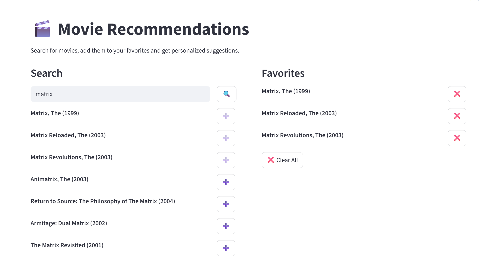
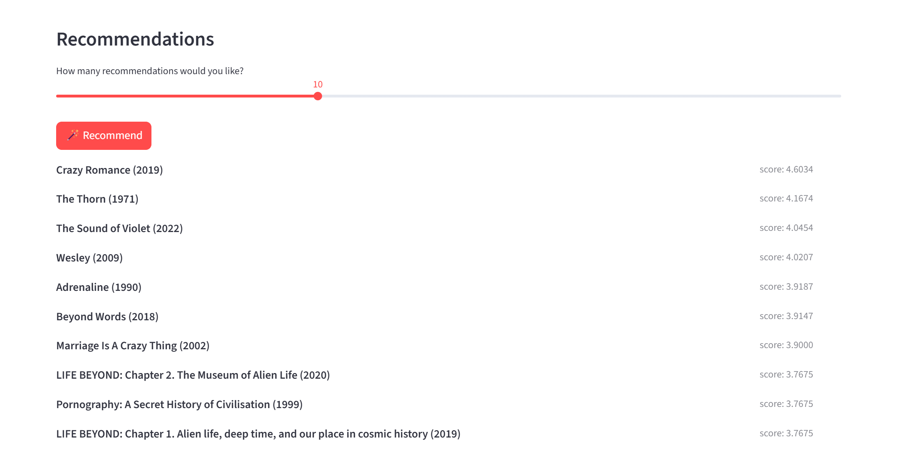

# Movie Recommendation System

[](LICENSE) [](https://www.python.org/) [](https://spark.apache.org/docs/latest/api/python/)  [](https://pandas.pydata.org/)  [](https://numpy.org/) [](https://streamlit.io/)

A movie recommendation system built with Apache Spark and Python.

## ✨ Features

This project provides:
- Collaborative filtering-based movie recommendations using Apache Spark's ALS algorithm
- Fast search for movie titles
- Interactive web UI built with Streamlit
- Easy retraining pipeline for new data
- Exported model artifacts for efficient serving

## 📂 Project Structure

```
spark-movie-recommendation-system/
│
├── app/                        # Streamlit web app source code
│   ├── main.py                 # Main Streamlit app entry point
│   └── utils.py                # MovieRecommendationsEngine and helpers
│
├── artifacts/                  # Model artifacts and exported files (not tracked)
│   ├── movie_factors.npy       # Numpy array of movie factor vectors
│   ├── movie_id_index.csv      # Mapping of movieId to index/title
│   └── als_model/              # Exported Spark ALS model
│       ├── itemFactors/        # Parquet files for item (movie) factors
│       ├── userFactors/        # Parquet files for user factors
│       └── metadata/           # Model metadata
│
├── data/                       # Input data files (not tracked)
│   ├── movies.csv              # Movie metadata (download from GroupLens)
│   ├── ratings.csv             # User ratings (download from GroupLens)
│   └── README.md               # Data download instructions
│
├── trainer/                    # Model training pipeline
│   └── trainer.py              # PySpark ALS training script
│
├── requirements.txt            # Python dependencies
├── LICENSE                     # Project license (MIT)
└── README.md                   # This file
```
## 📋 Requirements

- Python 3.13 or later
- Required Python packages listed in [requirements.txt](requirements.txt)

## 📦 Installation

1. Clone this repository:
	```sh
	git clone https://github.com/albertopd/spark-movie-recommendation-system.git
	cd spark-movie-recommendation-system
	```
2. Install dependencies:
	```sh
	pip install -r requirements.txt
	```
3. Download the MovieLens dataset (see `data/README.md`).

## ⚙️ Configuration

No special configuration is required. Ensure the paths in `app/main.py` and `trainer/trainer.py` match your data and artifact locations if you change the structure.

## 🚀 Usage

### 1. Train the Model

Run the training script to generate model artifacts:
```sh
python trainer/trainer.py --movies data/movies.csv --ratings data/ratings.csv --out artifacts/
```

### 2. Launch the Web App

Start the Streamlit app:
```sh
streamlit run app/main.py
```

The app will be available at [http://localhost:8501](http://localhost:8501).

## 🌐 Web App Screenshots





## 📜 License

This project is licensed under the [MIT License](LICENSE).

## 👤 Author

[Alberto Pérez Dávila](https://github.com/albertopd)